# Railway Inspection &amp; Compliance Management System

An inspection and compliance platform for the Railway Commercial Department, covering three
inspection streams through one common workflow. It is set up for the **Bilaspur division of South
East Central Railway**, on the division's own station data:

| Module | Scope |
| --- | --- |
| **Passenger Amenities** | Facilities and services provided to passengers at stations and other passenger interfaces |
| **Commercial Inspection** | Commercial working, revenue, contracts, licences, ticketing, catering, parcel and parking |
| **Safe Running &ndash; Commercial** | Commercial-department items bearing on safe, orderly and compliant running of passenger trains |

The inspector's job stays simple &mdash; **select &rarr; observe &rarr; assign &rarr; submit**. Everything
after that is automatic:

```
One inspection -> many observations -> automatic responsibility -> automatic notification
   -> time-bound compliance -> verification -> closure -> analytics
                            \-> compiled into one numbered Inspection Note
```

<p align="center">
  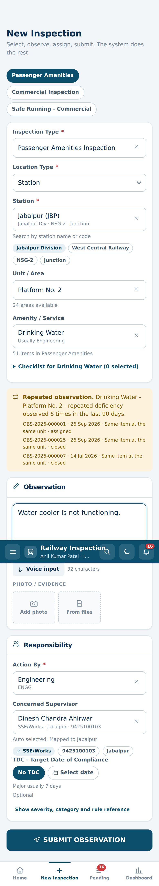
  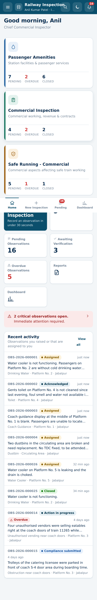
</p>

---

## The division's own data

The masters are not sample data. They are loaded from the division's records:

| From | What it gives |
| --- | --- |
| PAMS extract, sheet `1_PAMS_DATA` | 89 stations with their code, name, section, category, state, district and chainage, and what each one has: booking windows, UTS counters, catering, retiring rooms, FOB, second entry, water supply, Divyangjan facilities, passengers a day |
| PAMS extract, sheet `5_PLATFORMS` | Platform counts, which decide the areas the inspection screen offers |
| Divisional dashboard, `Station_Info` | Category, platforms and the corrected coordinates |
| Divisional dashboard, `MEA_Amenities` | **Minimum Essential Amenities: what is provided against what the norm requires**, for twelve amenity items at every station |

That gives the division as it is: 89 stations on 8 sections, from Bilaspur (NSG-2, 8 platforms,
51,067 passengers a day) to the halts on the Chirimiri and Ambikapur branches.

Two things in the system are still placeholders, and are marked as such wherever they appear:

* **Names.** Every user account and supervisor record is a **post**, not a person &mdash; "SSE/Works -
  Champa", "Station Manager - Bilaspur". Putting invented names next to real station data would be
  worse than useless, so the division fills the officer's name and mobile in from the Admin Panel.
  The engineering posts and the stations each answers for come from PAMS, which names the Inspector
  of Works' unit against every station.
* **Trains.** PAMS carries stations, not trains, so the train master is four services the division
  handles &mdash; enough to record and demonstrate a train inspection, and to be replaced by the
  divisional list.

## Quick start

```bash
npm install                 # installs the API and the web client
npm run seed:reset          # master data + a demonstration dataset
npm run dev                 # API on :4000, web client on :5173
```

Open <http://localhost:5173> and sign in with any seeded account &mdash; password `Railway@2026`:

| Employee ID | Role | Who they are |
| --- | --- | --- |
| `CMI01` | Inspecting officer | Chief Commercial Inspector, Jabalpur |
| `SSEEL01` | Supervisor | SSE/Electrical &mdash; receives the assigned observations |
| `SRDCM01` | Divisional officer | Sr. DCM &mdash; dashboards, monitoring, verification |
| `ADMIN01` | Administrator | Full system control, master data, audit trail |
| `VIEW01` | Viewer | Read-only |

The sign-in screen lists every demonstration account (outside production) so nothing has to be
looked up.

### Running it as one process

```bash
npm run build               # builds the web client into web/dist
npm start                   # the API serves the API and the built client on :4000
```

### Try it without installing anything

[`demo/railway-inspection-demo.html`](demo/railway-inspection-demo.html) is the whole application in
a single file &mdash; open it in a browser and it runs with no server and no network. The workflow,
assignment, repeat detection, dashboards and CSV export are all live; see
[`demo/README.md`](demo/README.md) for a walkthrough and for what needs the server.

```bash
npm run build:demo        # rebuild it from the current seed
```

### Tests

```bash
npm test                    # 140 tests: 127 against the server, 13 against the offline backend
npm run test:server         # engines, workflow, RBAC, sync, reports, TDC, supervisor links,
                            # suggested deficiencies, notes, station import, the inspection
                            # sheet, the report and its issuing, and the schema migration
npm run test:demo           # the offline backend's own rules, asserted directly
npm run smoke               # 84-check end-to-end walkthrough against a running server
npm run check:demo          # drives the built offline file in a real browser from file://
```

`npm test` runs against throw-away databases and needs nothing else. `npm run smoke` drives the
reference scenario through a running server (`npm start`) and prints each check as it goes.

**The offline build has a second backend**, and that is worth two checks of its own.
`web/src/demo/router.ts` reimplements the server's engines in the browser so the single-file
demonstration runs the real UI with no server &mdash; and two implementations of the same rules
drift. When the demo one is wrong it fails as a toast *inside the page*: no console error, no failed
request, nothing a type-check or a server test can see.

* `npm run test:demo` bundles that router with esbuild and calls it directly, so its rules can be
  asserted rather than inferred from what the screen happens to show. It runs as part of `npm test`.
* `npm run check:demo` drives the *built* file in a real browser, walking an inspection through to
  its issued report, and fails on any error toast, any page error, or **any network request at
  all**. Playwright is not a dependency of this repository, so it says how to install it and skips
  rather than failing if it is absent:

```bash
npm i -D playwright && npx playwright install chromium
```

---

## What the system does

### 1. The inspection, not the observation

One commercial inspector attends to many areas &mdash; often every area &mdash; of a station in a
single visit. The inspection is therefore the unit of record, and the areas sit inside it:

```
Start:   Module -> Type -> Station / Train / Section -> time, accompanied by  -> START
Work:    Part I  review what the last inspection left outstanding
         Part II every area of the station, each one:  in order | deficiency | N/A
Finish:  complete -> issue the report  (office number, financial-year series)
```

* **Starting an inspection puts the whole station on its sheet**, every area beginning at *not
  inspected*. That distinction is the point: the record can tell an area found in order from an
  area nobody looked at, which a list of deficiencies cannot.
* **One tap per item.** Each area opens to its checklist, grouped and collapsed &mdash; a station
  carries two hundred inspection items, so only the group being worked through is open. The
  catalogue is scoped to the kind of area, so the booking office is offered the ticketing checks
  and a platform is not. "Whole area in order" covers the common case in one tap.
* **A deficiency opens the observation form** with the area and the item already filled in, and the
  form closes again once it is recorded. Recording it marks the area and the item automatically, so
  the inspector never says it twice &mdash; and an area carrying a live observation cannot then be
  marked in order.
* **Part I is the continuity.** The previous inspection of that *place* (not of that officer) is
  found automatically and its outstanding items are listed for review. A finding of *complied* is
  verification on the ground, so it closes the observation then and there; *not complied* on a
  submitted compliance reopens it. Neither ever rewords what was submitted.
* **Searchable dropdowns everywhere**, **voice-to-text** for the observation (Web Speech API,
  hidden where unsupported), **camera capture**, and **checklist parameters** per item, all
  configurable by the administrator.
* **A dropdown of what usually fails.** Picking the item offers the common deficiencies for it, and
  choosing one fills the wording, the department and the TDC in a single tap. See below.
* **The inspector never types a mobile number.** Station + Unit + Action By resolves the concerned
  supervisor automatically.
* **TDC stays optional** &mdash; "No TDC" is a first-class choice.
* Finishing warns about areas still not attended to rather than silently reporting them as such.

<p align="center">
  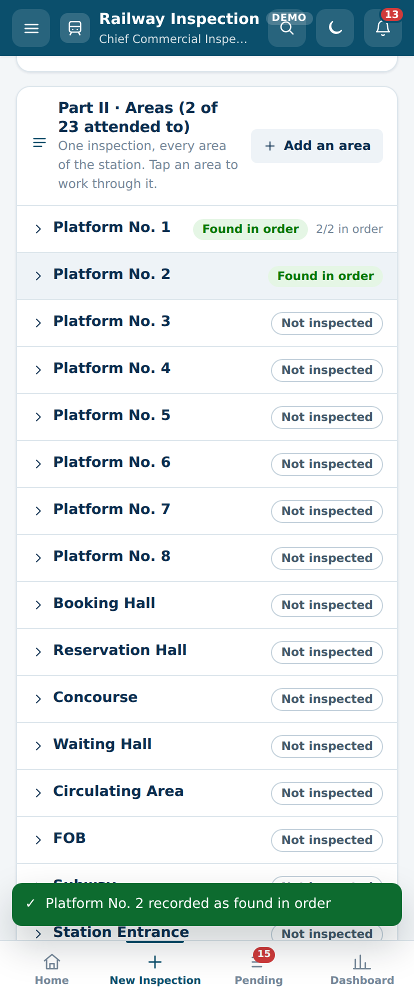
</p>

### 1a. The inspection report

`/reports/inspection/:id` is the report of the visit, in the parts a commercial inspection report
has always had:

| Part | What it carries |
| --- | --- |
| I | What the previous inspection of this place left outstanding, and its position at this visit |
| II | Every area on the sheet &mdash; attended to, found in order, not inspected or not available |
| III | The deficiencies noticed, with responsibility, supervisor and target date |
| IV | **What was checked and found in order.** The part a list of deficiencies cannot have |
| V | General remarks |

<p align="center">
  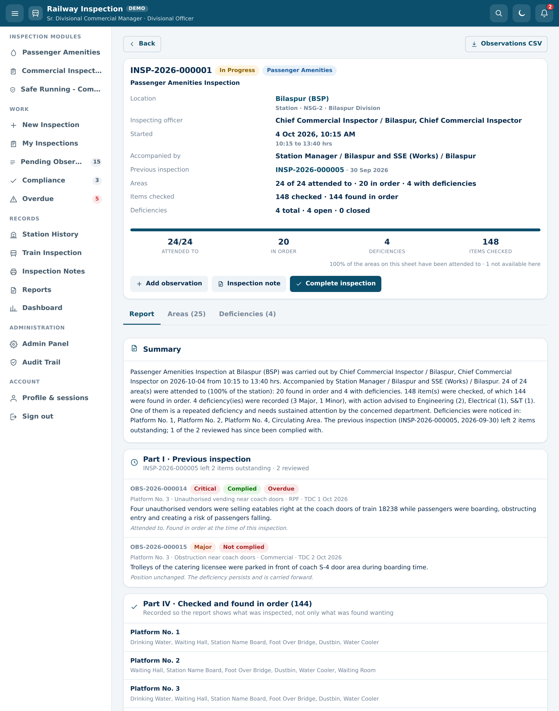
</p>

PDF, CSV and Excel, with the photographic annexure, the signature block and a QR code that
verifies without a login. An inspection that found a station in good order produces a report that
says so, rather than an empty page. Issuing the report gives it a financial-year office number
(`BSP/COM/SI/2026-27/008`) and freezes the sheet behind it, while the status of every observation
it cites still reads live.

### 2. Smart assignment

`Station + Unit + Action By (+ item)` resolves the responsible supervisor from the Concerned
Supervisor Master, best match first, and says *why* it matched:

| Rank | Match |
| --- | --- |
| 10 | Explicit coverage for this exact station and unit |
| 20 | Explicit coverage for this station and unit kind (all platforms, all toilets &hellip;) |
| 25 | Coverage for this inspection category |
| 30 | Coverage for this station |
| 40 | Linked to this station, area of responsibility matches the unit |
| 50 | Posted at this station in this department |
| 55 | Covers this station in this department (a section link, not the posting) |
| 60 | Nominated departmental supervisor |
| 70 | Any active supervisor in the department |

**A supervisor is linked to stations and to departments, not just to one of each.** The posting on
the supervisor's own record is one station link and one department link; further links cover the
rest of the section, or a second department. So a section SSE posted at Gadarwara is found at
Pipariya, Bankhedi and every other station on the link, and a Station Manager can answer for both
Commercial and Operating. Someone who only *covers* a department ranks two points below the people
whose department it actually is, so the right person still wins a tie. Admin &rarr; Supervisors
edits both sets of links; nothing is deleted, only deactivated, so observations already assigned
keep pointing at a valid record.

If several supervisors qualify, the best is pre-selected and the rest stay in a searchable
dropdown. If none exists, the observation is still recorded and the divisional office is told that
a nomination is missing.

### 3. Repeated deficiency detection

Before the inspector submits, the system looks back over a configurable window and flags
recurrences:

> **Drinking Water &ndash; Platform No. 2 &ndash; repeated deficiency observed 3 times in the last 90 days.**

Matching is by unit + item, by item at the same location, or by keyword overlap (with a small
stemmer, so "not functioning" matches "not functional") within the same category. Each match shows
its reason, similarity and status, and a **photo comparison** view puts the current photographs
next to the earlier ones.

### 4. Suggested deficiencies

Picking the inspection item offers a dropdown of what usually fails, narrowest scope first:

| Scope | Example under *Water Cooler* |
| --- | --- |
| The item | *Water cooler is not functioning.* &middot; *Water cooler functioning but water is not cool* |
| Its group | *Water supply not available at the time of inspection* &middot; *Tap leaking, water being wasted* |
| Its module | *Amenity provided but unusable by passengers in its present condition* |
| Everywhere | *Water Cooler not available* &mdash; one stored row, worded for whichever item is selected |

<p align="center">
  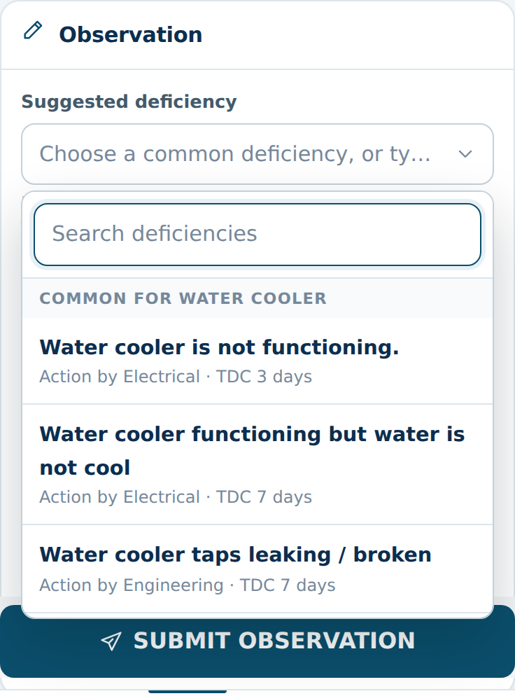
</p>

Choosing a suggestion fills the observation text and, where the suggestion says so, the department
in *Action By*, the severity and a suggested TDC. **The wording stays editable**: a suggestion is a
starting point, and text the inspector has already typed is kept and added to rather than
overwritten. Wordings already recorded for that item at that station are offered under their own
heading, so the list gets more useful the longer the system is in service.

Because the screen records *which* suggestion an observation came from, the dashboard can answer
"which deficiencies are reported most often" as a straight count rather than by matching text
&mdash; which is the list that tells the division what to fix systemically rather than one
observation at a time. All of it is master data: Admin &rarr; Suggested deficiency adds, rewords or
retires a suggestion without a code change.

### 5. The norm, at the moment of recording

The division's MEA return says what is provided at each station against what the norm requires. The
New Inspection screen shows the line for the item being inspected, so the officer has it in front of
them rather than looking it up afterwards:

> **Minimum essential amenities** at Pendra Road
> Water Coolers &mdash; **3** provided against **4** required (nos) &nbsp; `Short by 1`

The station page carries the whole return, and what the station actually has &mdash; booking windows,
catering, retiring rooms, foot over bridges, Divyangjan facilities, water supply, and the engineering
unit that answers for it &mdash; with the date the divisional record was last updated.

<p align="center">
  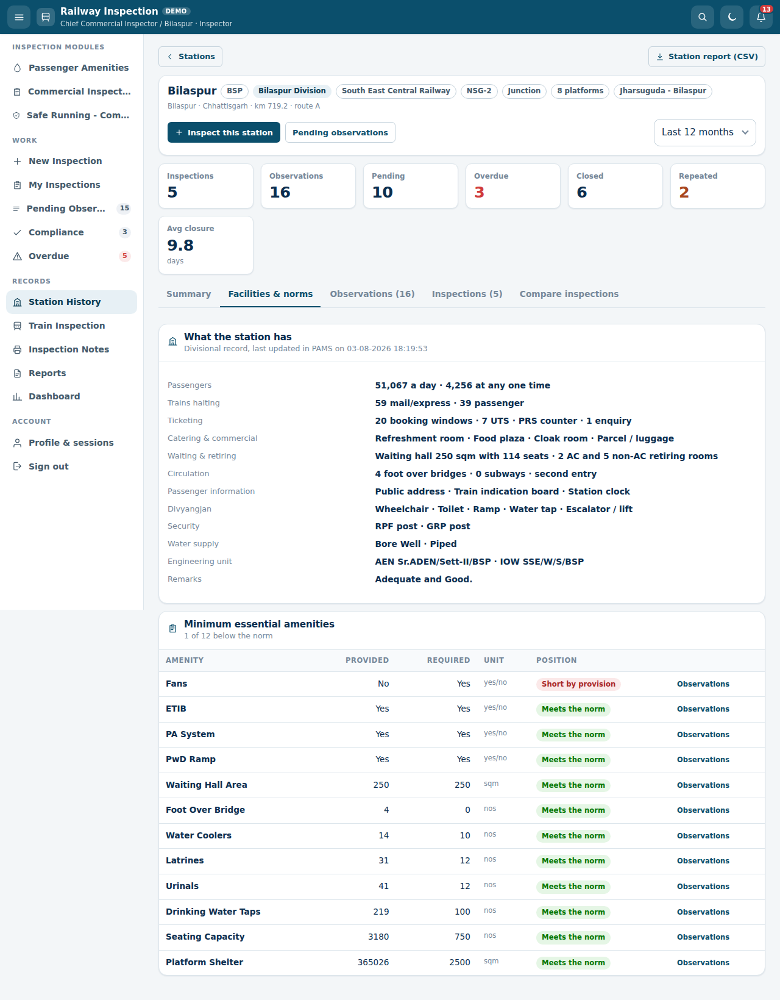
</p>

### 6. The Inspection Note

An inspection produces a list of observations, each already assigned with its own target date. What
goes out of the office, though, is a letter. **Inspection Note** compiles them into one:

```
WEST CENTRAL RAILWAY
Office of the Divisional Railway Manager (Commercial), Jabalpur Division
-----------------------------------------------------------------------
No. JBP/COM/INSP/2026-27/014                        Date: 30 September 2026

To,   The Concerned Supervisors / Departmental Officers
Sub:  Deficiencies noticed during passenger amenities inspection at Jabalpur

Sl.  Location / Unit   Item            Deficiency noticed     Action by   TDC
 1   Platform No. 2    Water Cooler    Water cooler is not    Electrical  02.10.2026
                                       functioning.
```

<p align="center">
  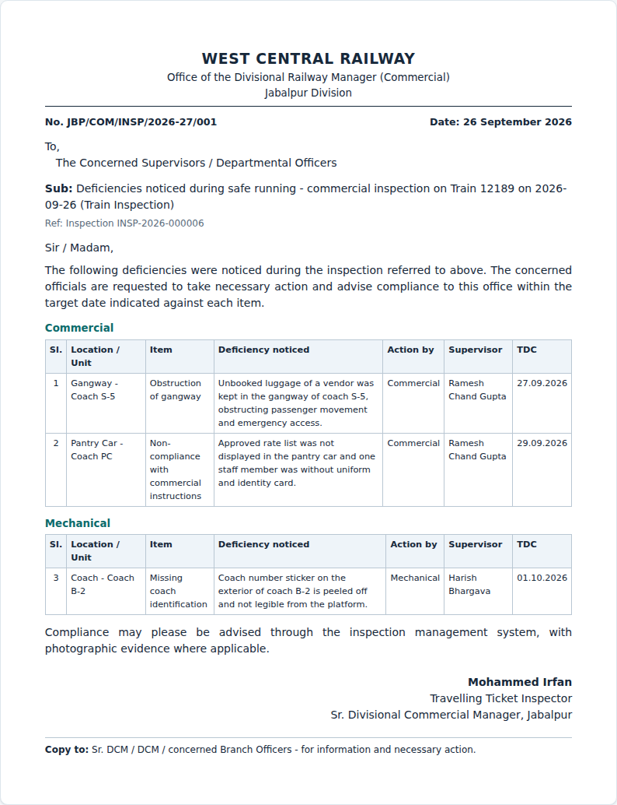
</p>

* Compiled **from one inspection**, or from **observations picked across several** &mdash; tick them
  in the observation list and choose *Compile inspection note*.
* The subject, the addressee, the opening and closing paragraphs, the signatory and the copy-to list
  are all editable before it goes out, and the standing wording comes from settings so the office
  format is set once.
* Optionally **grouped by the department that has to act**, which is how each department reads it.
* Prints as a **PDF letter** from the server, or straight from the browser; also exports as CSV.
* Every note carries a **running number in the office series** (restarting each financial year) and a
  QR code that verifies it without a login.
* A note is a **record**: once issued its wording is fixed &mdash; it can be cancelled and replaced,
  not quietly rewritten. Reopening it shows where each item now stands against the letter as it went
  out.

### 7. Time-bound compliance

```
Submitted -> Assigned -> Acknowledged -> Action in progress
          -> Compliance submitted -> Verified -> Closed
```

with `Rejected`, `Reopened` and `Cancelled` as alternate outcomes. **Overdue is derived**, not
stored: an observation is overdue when its TDC has passed and the department still owes an action,
so the badge can never drift out of step with the workflow. An observation whose compliance is
already submitted is awaiting the inspecting officer, not the department, and is not counted
against the department.

A daily sweep sends pre-due reminders, due-date reminders and overdue reminders, and escalates
through the configured hierarchy (reporting officer &rarr; divisional officer &rarr; divisional
head). The sweep is idempotent per day, so running it twice never double-notifies.

Verification gives the inspecting officer three outcomes: **accept** (closed, with an optional
digital signature), **reject** (reopened, reason mandatory) or **physical verification required**
(stays open until seen on the ground). Every round of compliance is kept &mdash; nothing is
overwritten.

### 8. Dashboards and reports

<p align="center">
  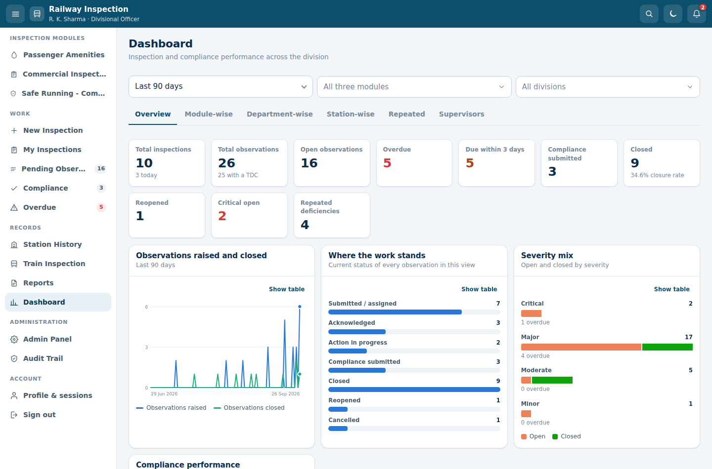
</p>

<p align="center">
  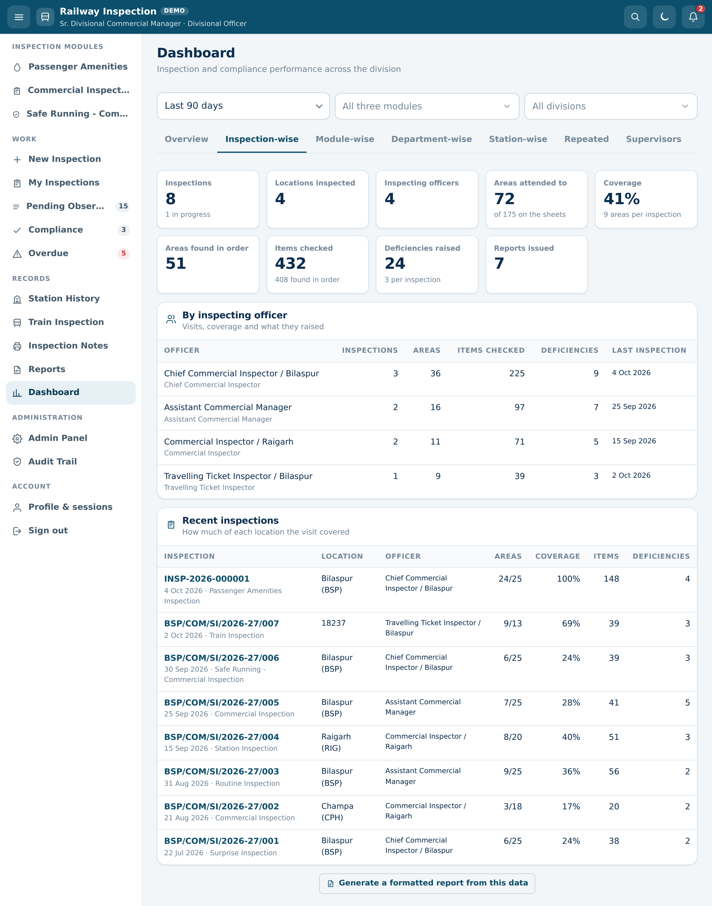
</p>

Overview, **inspection-wise**, module-wise, department-wise, station-wise, severity, 90-day trend,
repeated deficiencies, **most reported deficiencies** and a supervisor scoreboard, all honouring the
same filters.

The reports come in two kinds, and the page says which is which. Most of them count
**observations**, which answers what is wrong and who has to fix it. Three count **inspections**,
which answers the other half &mdash; whether the inspecting is happening and how much of each
station it reached:

* **Inspection Report** &mdash; one visit in full, in its five parts.
* **Inspection Register** &mdash; one row per inspection, never one per area: date, location,
  officer, areas on the sheet, areas attended to, coverage, items checked and deficiencies raised.
* **Inspector-wise** &mdash; the same visits summed by the officer who made them, with average
  coverage and closure rate.

All of them export as **PDF, Excel or CSV**, and every PDF carries a **QR code** that verifies the
report against the live record without a login.

### 9. Works offline

The web client is an installable PWA. With no connectivity it keeps the master data it last saw,
records inspections, observations and photographs in IndexedDB, shows **"Offline &ndash; saved
locally"**, and uploads everything automatically when the signal returns
(**"Successfully synced"**). Every queued item carries a client UUID, so a retry can never create a
duplicate. The pending queue is visible and under the inspector's control.

### 10. Administration and audit

<p align="center">
  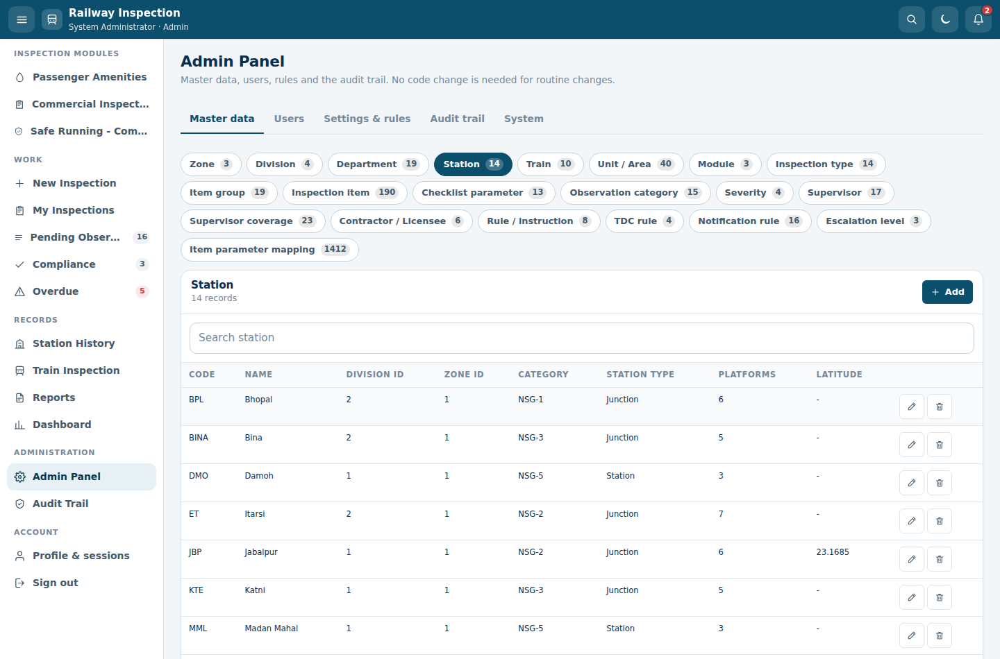
</p>

Twenty-four master tables are editable from the Admin Panel &mdash; stations, units, amenities,
inspection items, suggested deficiencies, checklist parameters, departments, supervisors with their
station and department links and their coverage, trains, contractors and licensees, severities,
categories, TDC rules, notification rules and the escalation hierarchy. **Routine master-data
changes never need a code change.** Masters are deactivated rather than deleted, so historical
observations keep pointing at a valid record.

Two screens are purpose-built because the generic table editor is the wrong tool for them:

* **Supervisors** &mdash; pick a supervisor and tick off the stations and the departments they answer
  for. This is what the assignment engine reads.

  <p align="center">
    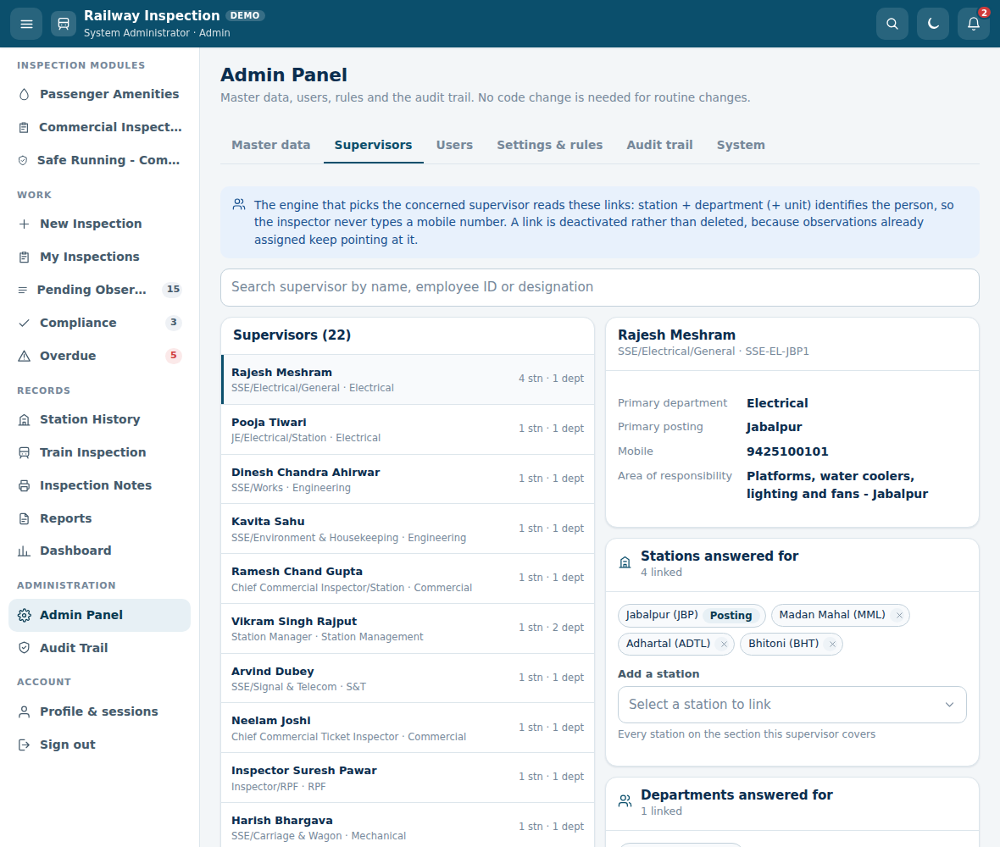
  </p>

* **Stations &rarr; Import** &mdash; the station list is the one master every division has to replace
  with its own, and editing forty stations one at a time is not a reasonable way to do it. Export
  gives the current list in exactly the shape the importer accepts; import identifies a station by
  its code, so a known code is updated and a new one added. Column headings do not have to match
  exactly: a file prepared in the works office saying `Station Code` and `No. of Platforms` is read
  as it stands. **Check** shows what the file would do before anything is written, and names the line
  and the reason for every row it would skip. Nothing is ever deleted: a station left out of the file
  can be deactivated, and stays in the database so that past observations still resolve.
  [Handing the station list over &rarr;](docs/STATION-LIST.md)

Every state-changing action writes an audit row with the user, role, timestamp, action, entity and
the **previous and new value**. Submitted observations are never silently modified: the text can be
corrected only by the raising officer before acknowledgement (or by an administrator), and every
correction is recorded on the timeline and in the audit trail.

---

## Architecture

```
railway-inspection-suite/
├── server/                  Node.js + Express + SQLite (better-sqlite3)
│   ├── src/db/              schema.sql, migrations, seed + master data
│   ├── src/lib/             assignment, repeats, notify, scheduler, exporters, queries
│   ├── src/services/        observation service shared by the API and offline sync
│   ├── src/routes/          auth, masters, inspections, observations, compliance,
│   │                        dashboard, history, reports, notifications, search, sync, admin
│   └── tests/               node:test + supertest
└── web/                     React 18 + TypeScript + Vite (PWA)
    ├── src/components/      UI kit, charts (hand-built SVG), app shell
    ├── src/pages/           one file per screen
    ├── src/state/           auth, offline queue, toasts
    └── public/              manifest, service worker, generated icons
```

**Why SQLite.** The whole system runs from one process with no external services, which suits
divisional deployment and makes evaluation trivial. The data layer is plain SQL behind small
helpers, so moving to PostgreSQL is a schema translation rather than a rewrite.

**Scaling to more modules.** A new inspection stream is a row in `modules` plus its item groups and
items. Nothing in the workflow, assignment, reminder, reporting or dashboard code is aware of which
module an observation belongs to, so additional modules and departments need no redesign.

### Roles

| Role | Can do |
| --- | --- |
| Administrator | Everything, including master data, users and system operations |
| Divisional Officer | Dashboards, monitoring, reports, verification, reassignment, cancellation |
| Inspecting Officer | Create inspections and observations, assign, verify compliance |
| Supervisor | See assigned observations, acknowledge, submit compliance |
| Viewer | Read-only |

Access is enforced on the server in two layers: a capability check per endpoint, and a row-level
scope (a supervisor sees the observations assigned to them or to their department at their station;
officers and inspectors see their division).

### Security

Password and OTP sign-in (bcrypt, JWT with server-side session records), account lockout after
repeated failures, session timeout and revocation, rate limiting, Helmet with a content-security
policy in production, whitelisted master-data columns, parameterised SQL throughout, upload type
and size limits, evidence served only to an authenticated session, and a complete audit trail.
`JWT_SECRET` is mandatory in production &mdash; the server refuses to start without it.

One trade-off worth knowing: photographs and report downloads are opened directly by the browser,
which cannot send an `Authorization` header, so those requests carry the session token as a query
parameter. The access log redacts it, and sessions are revocable and time-limited &mdash; but the
deployment should terminate TLS so the token is never in the clear. If a stricter posture is
needed, issue short-lived download tokens in `routes/files.js` and `lib/http.js`.

---

## Configuration

Copy `server/.env.example` to `server/.env`. Everything has a working development default:

| Variable | Purpose |
| --- | --- |
| `PORT`, `HOST` | API binding |
| `DATA_DIR`, `DB_FILE`, `UPLOAD_DIR` | Where the database, evidence and backups live |
| `JWT_SECRET` | **Required in production** |
| `SESSION_TIMEOUT_MINUTES` | Session lifetime |
| `SCHEDULER_ENABLED`, `SCHEDULER_CRON`, `SCHEDULER_TZ` | TDC reminder and escalation sweep |
| `EMAIL_ENABLED`, `SMTP_URL`, `SMS_ENABLED`, `SMS_GATEWAY_URL` | Notification channels |
| `WEB_ORIGINS`, `PUBLIC_URL` | CORS and the URL embedded in report QR codes |

In-app notifications are always live. Email and SMS are pluggable: point them at a gateway URL, or
enable them without one and messages are written to the server log and recorded as sent by the
`log` provider &mdash; so delivery status stays honest in every deployment.

---

## The reference scenario

The seeded data reproduces the specification's end-to-end test, and the workflow test suite drives
it on every run:

> **Inspection Type** Passenger Amenities &middot; **Station** Bilaspur &middot; **Unit** Platform No. 2 &middot;
> **Amenity** Drinking Water &middot; **Observation** "Water cooler is not functioning." &middot;
> **Action By** Electrical &middot; **Supervisor** identified automatically &middot; **TDC** 30 September 2026 &middot;
> **Photo** attached

On submit the system generates the observation ID, saves it, identifies the SSE/Electrical post for
that section from the Supervisor Master, sends the notification, shows it in that queue, starts TDC
monitoring, accepts the compliance, notifies the inspecting officer, and closes the observation on
acceptance &mdash; updating every dashboard and report on the way.

<p align="center">
  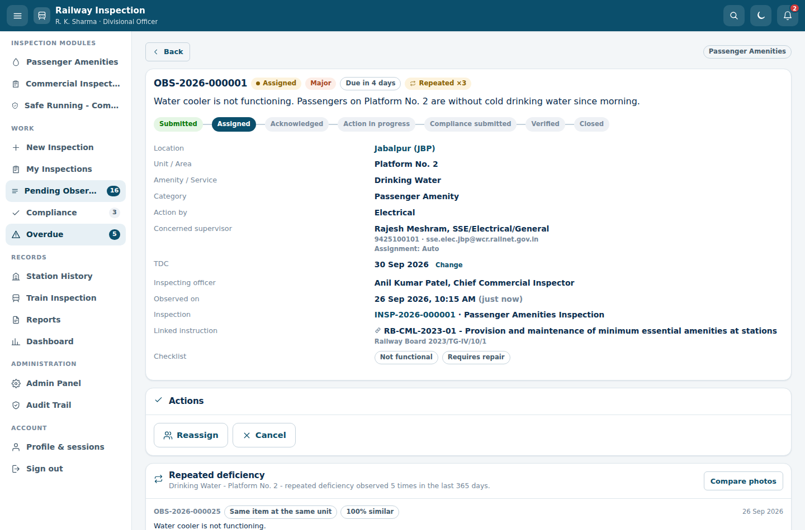
</p>

The observation text is the first entry in the suggested-deficiency dropdown for Water Cooler, so in
practice the inspector taps it rather than typing it &mdash; and the department and the TDC come with
it.

The same dataset also carries earlier occurrences of that deficiency, so the repeated-deficiency
banner appears before the inspector even submits, and observations in every other state: acknowledged,
action in progress, compliance submitted, rejected and reopened, closed, overdue and escalated,
cancelled, with and without a TDC, at stations and on trains, across all three modules. One issued
Inspection Note is seeded too, so the letter format is visible without having to compile one first.

## Further documentation

* [`docs/API.md`](docs/API.md) &mdash; every endpoint, its parameters and its access rules
* [`docs/DATA-MODEL.md`](docs/DATA-MODEL.md) &mdash; tables, relationships and the derived fields
* [`docs/STATION-LIST.md`](docs/STATION-LIST.md) &mdash; putting the division's own station list in,
  with [a template](docs/station-list-template.csv) to send to the works office
